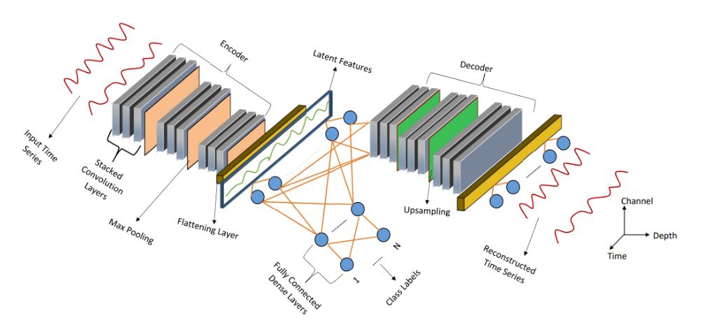
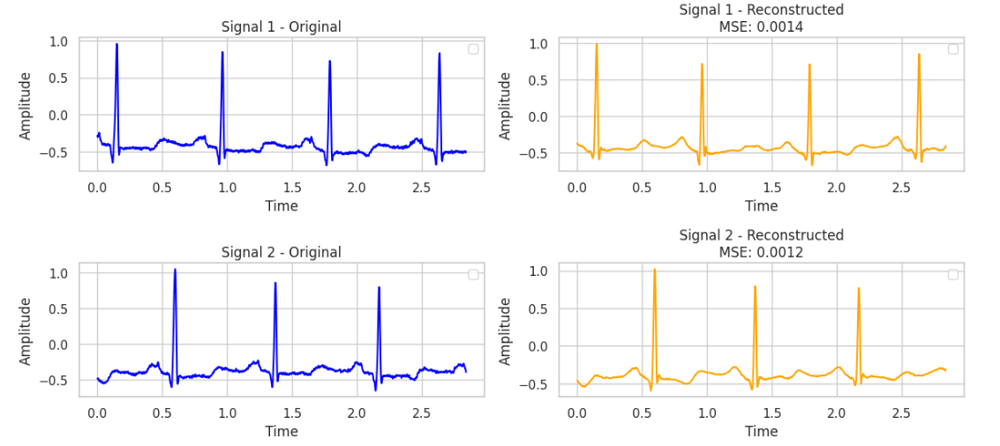
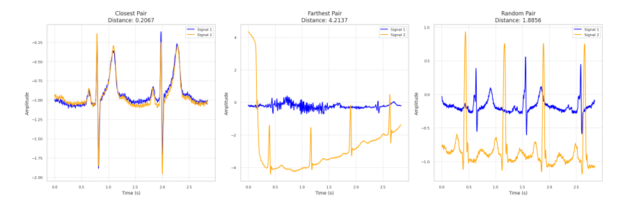
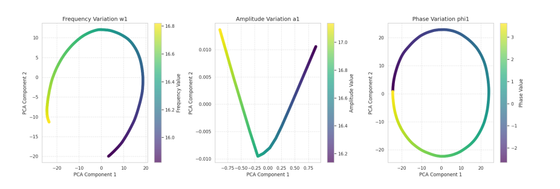

# Signal Distance Measurement using Auto-encoder Latent Space

> **An innovative approach using convolutional autoencoders to define robust and meaningful distances between temporal signals in a structured latent space.**

## Overview

Measuring distances between signals accurately is critical in many fields such as biomedical engineering, signal processing, and financial analysis. Traditional methods like Euclidean distance or Dynamic Time Warping (DTW) often fail to handle noise, phase shifts, or computational complexity adequately.

This project addresses these issues by developing a convolutional autoencoder (CAE) that learns a latent representation of signals specifically structured to preserve meaningful distances defined in the original parameter space.


## Motivation and Theoretical Background

Conventional distance metrics have significant limitations:

- **Euclidean distance** is intuitive but sensitive to noise and phase shifts.
- **Fourier-based methods** are computationally efficient but fail under time shifts.
- **DTW** handles distortions but is computationally costly (O(n²)).

By training an autoencoder to preserve a defined metric in its latent representation, we obtain a robust alternative that overcomes these limitations, capable of efficient clustering, classification, and anomaly detection.

## Methodology

### Latent Representation via Convolutional Autoencoder

The convolutional autoencoder comprises:

- **Encoder**: Compresses signals into a lower-dimensional latent representation.
- **Decoder**: Reconstructs signals from latent vectors.

The latent vector $z \in \mathbb{R}^d$ encodes intrinsic properties of signals.



### Distance Definition in Latent Space

Two primary distance metrics are considered in the latent space:

- **Euclidean distance**:
  
```math
d(z_i, z_j) = \sqrt{\sum_{k=1}^{d}(z_{i,k} - z_{j,k})^2}
```

- **Cosine distance**:
```math
d(z_i, z_j) = 1 - \frac{\langle z_i, z_j \rangle}{\|z_i\|\cdot\|z_j\|}
```

### Training Objective (Loss Function)

The model’s loss combines signal reconstruction accuracy and the preservation of distances defined by original signal parameters:

```math
\mathcal{L} = \alpha\frac{1}{N}\sum_{i=1}^{N}\|s_i - \hat{s}_i\|^2_2 + \beta\frac{1}{N^2}\sum_{i,j=1}^{N}\left(\|\theta_i - \theta_j\|^2_2 - \|z_i - z_j\|^2_2\right)^2
```

- $s_i, \hat{s}_i$: original and reconstructed signals
- $z_i$: latent representation
- $\theta_i$: original signal parameters
- $\alpha, \beta$: weighting hyperparameters

## Experiments and Results

### Synthetic Signal Analysis

Initially, the model was trained on synthetic signals composed of polynomial and cosine terms:

```math
s(t) = \sum_{i=0}^{3} a_i t^i + \sum_{i=1}^{8} b_i \cos(w_i t + \varphi_i)
```

This controlled setting demonstrated the CAE’s capacity to preserve complex parametric relationships in latent space.

### Real ECG Data Application

The method was further validated using real ECG signals. The CAE successfully encoded the complex temporal dynamics and robustly reconstructed the signals, making it suitable for medical anomaly detection.





## Latent Space Insights

Analysis using PCA on latent representations showed clearly structured parameter trajectories, confirming that the latent space preserves the intrinsic geometry of signals.



Key findings:

- Clear separation of distinct signal classes.
- Robustness of distance preservation even under noisy conditions.
- Effective encoding of nonlinear signal characteristics.

## Getting Started

### Requirements

- Python ≥ 3.10
- PyTorch
- NumPy, Pandas, SciPy
- Matplotlib, seaborn
- Jupyter Notebook

Install dependencies:
```bash
pip install -r requirement.txt
```

## References and Citations

If you use this project, please cite:

- Marius Dragic, *"Signal Distance Measurement using Auto-encoder Latent Space"*, CentraleSupélec, 2025.

Other relevant works:

- [Local Distance Preserving Autoencoders](https://arxiv.org/abs/2206.05909)
- [Latent Space Cartography](https://arxiv.org/abs/1902.02113)


## Future Work

- Generalize and validate the model on diverse temporal signals, including financial data.
- Investigate more complex autoencoder architectures (e.g., U-Net-like structures) for richer latent representations.
- Conduct comprehensive comparative analyses against traditional metrics.


## Contact

- **Marius Dragic** – [marius.dragic@student-cs.fr](mailto:marius.dragic@student-cs.fr)


## License

MIT License. See [`LICENSE`](LICENSE) file for details.


*This README rigorously documents the theoretical foundations, implementation details, and experimental outcomes of using autoencoders to measure distances between signals.*
